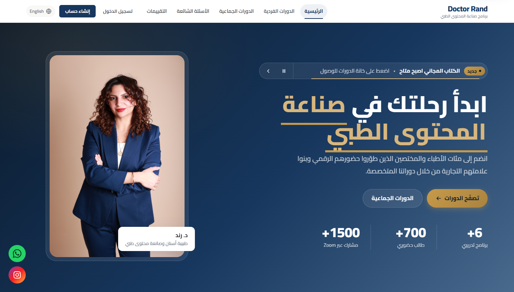
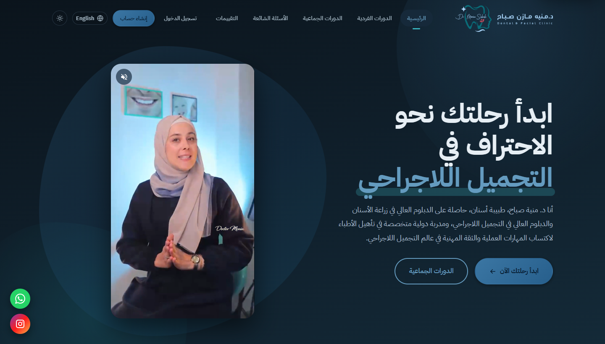
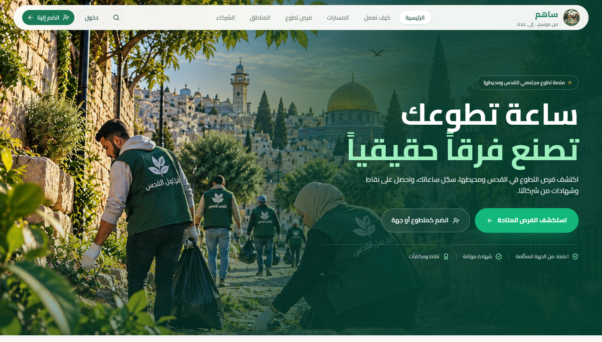
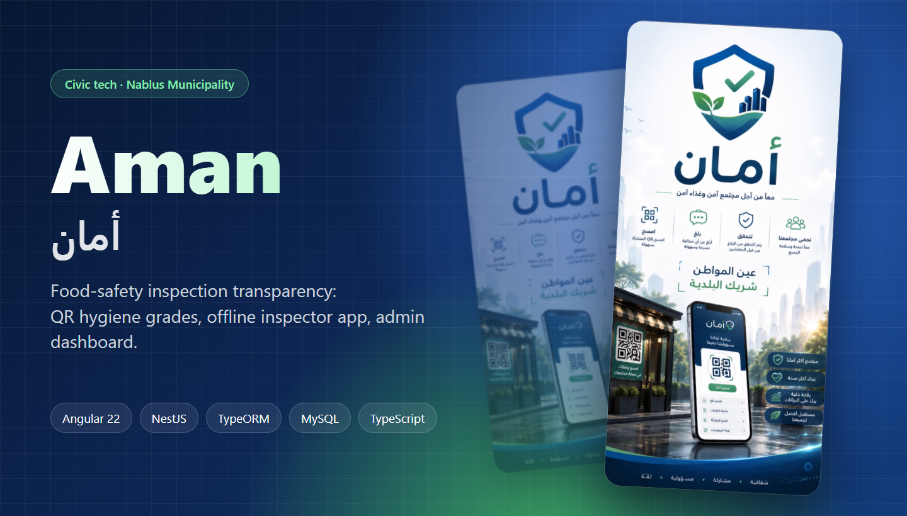
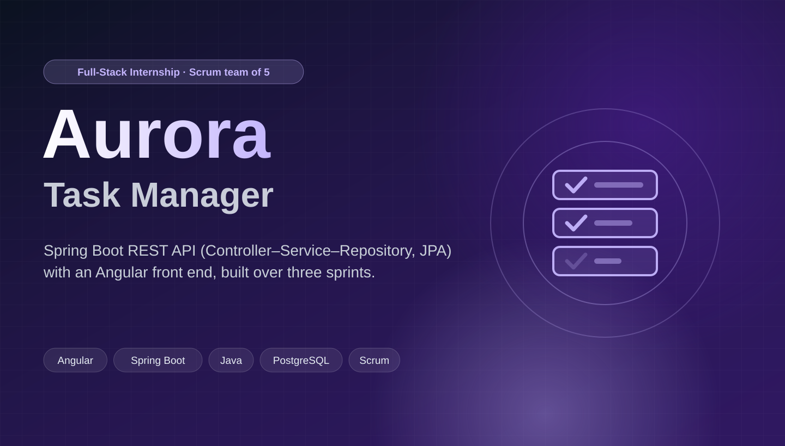

  

  

  
  
  

## 👋 About me

I'm a Computer Engineering student at **Birzeit University** (class of 2027) and a full-stack web developer based in Ramallah.
I've shipped **two production platforms for real clients**, with auth, online payments, video streaming and admin dashboards.
I build Arabic-first, so RTL is the default rather than an afterthought, and I work fast with AI-assisted development (Claude Code: agentic workflows, custom skills, MCP servers).

<table>
<tr>
<td width="50%" valign="top">

**💼 Experience**
- Full-Stack Web Development Intern · **Aurora** (2026)
- Full-stack developer · 2 production client platforms

</td>
<td width="50%" valign="top">

**🏆 Highlights**
- 🥉 3rd place · **Al-Quds Hackathon 2026**
- 🎯 TechBridge 2026 · selected **1 of 25** from 300+
- 🥈 2nd place (Python) · Birzeit problem solving

</td>
</tr>
</table>

## 🚀 Featured work

<table>
<tr>
<td width="50%" valign="top">

<h3><a href="https://doctor-rand.com/">Doctor Rand</a> · live in production</h3>
Arabic-first course and booking platform: enrolment, session booking, S3 video streaming, Lahza payments, email, and an admin dashboard.
  
<code>Flask</code> <code>MySQL</code> <code>JavaScript</code> <code>AWS S3</code> <code>Railway</code>
</td>
<td width="50%" valign="top">

<h3><a href="https://dr-monia.com/">Monia Sabah Academy</a> · live in production</h3>
Second production platform for an external client: courses, enrolment, bookings, and admin management.
  
<code>Flask</code> <code>MySQL</code> <code>JavaScript</code> <code>AWS S3</code> <code>Railway</code>
</td>
</tr>
<tr>
<td width="50%" valign="top">

<h3><a href="https://sahem-zqeu.vercel.app/">Sahem · ساهم</a> · 🥉 Al-Quds Hackathon · <a href="https://github.com/yahyasarhan22/Sahem">code</a></h3>
Turns neighbourhood cleanup and volunteering into an ongoing habit: nearby activities, tracked hours, PDF certificates, and an AI chatbot.
  
<code>React</code> <code>Vite</code> <code>Tailwind</code> <code>Supabase</code> <code>Vercel</code>
</td>
<td width="50%" valign="top">

<h3><a href="https://github.com/yahyasarhan22/Aman">Aman · أمان</a> · civic tech</h3>
Food-safety transparency for Nablus Municipality: QR hygiene grades, an offline risk-ranked inspector checklist, and an admin dashboard.
  
<code>Angular 22</code> <code>NestJS</code> <code>TypeORM</code> <code>MySQL</code>
</td>
</tr>
<tr>
<td width="50%" valign="top">

<h3><a href="https://github.com/yahyasarhan22/aurora-internship-project-V2">Aurora Task Manager</a> · internship</h3>
Full-stack task management app built in a Scrum team of five over three two-week sprints.
  
<code>Angular</code> <code>Spring Boot</code> <code>PostgreSQL</code>
</td>
<td width="50%" valign="top">

### More I've built

- **Masar · مسار**: AI academic companion app for Arab students, built in Flutter in 3 days (TechBridge 2026)
- **AI Resume Ranking**: NLP scoring of CVs against job descriptions for Harri (React, Flask, spaCy, scikit-learn)
- **[Package Delivery Optimization](https://github.com/yahyasarhan22/Package-Delivery-Optimization)**: Simulated Annealing and Genetic Algorithm routing
- **[Pan-Tompkins QRS Detection](https://github.com/yahyasarhan22/Pan_Tompkins_QRS_Detection_Algorithm)**: ECG signal processing with adaptive LMS thresholds

</td>
</tr>
</table>

<b>🔧 Engineering & coursework projects</b> (C, assembly, OS, networks, hardware)

 

| Area | Projects |
|---|---|
| **Data structures (C)** | [Course Planner & Campus Route Finder](https://github.com/yahyasarhan22/Course-Prerequisite-Planner-and-Campus-Route-Finder) · [Text Editor with Undo/Redo](https://github.com/yahyasarhan22/Text-Editor-with-Differential-Undo-Redo) · [AVL & Hash Table](https://github.com/yahyasarhan22/application-of-AVL-and-Hash-table) · [Radix Sort on Linked Lists](https://github.com/yahyasarhan22/Doubly-linked-list-with-radix-sort) |
| **Operating systems** | [Word Frequency: processes vs threads](https://github.com/yahyasarhan22/Word-Frequency-Analysis) · [CPU Scheduling Simulator](https://github.com/yahyasarhan22/CPU-scheduling-system) · [Course Log Analyzer (Bash)](https://github.com/yahyasarhan22/shell-online-course-log-analyzer) |
| **AI / ML** | [Image Classification: NB vs DT vs MLP](https://github.com/yahyasarhan22/comparative-study-of-image-classification) |
| **Networks** | [Socket Programming](https://github.com/yahyasarhan22/Socket-Programming) · [Cisco Packet Tracer Network](https://github.com/yahyasarhan22/Cisco-Packet-Tracer-Network) |
| **Architecture & hardware** | [Bin Packing in MIPS Assembly](https://github.com/yahyasarhan22/Bin-Packing-Problem-Solution-Using-MIPS-Assembly) · [Signed/Unsigned Comparator](https://github.com/yahyasarhan22/Build-a-comparator-for-signed-numbers-and-unsigned-numbers) · [Dark/Light Indicator Circuit](https://github.com/yahyasarhan22/Dark-and-Light-Indicator-Circuit) · [Micromouse Robot](https://github.com/yahyasarhan22/Micromouse-Robot) |
| **Signals & comms** | [ADALM-Pluto LSSB Transmission](https://github.com/yahyasarhan22/ADALM-Pluto-LSSB-Audio-Transmission) |
| **Apps & scripting** | [Pets & Things Store System](https://github.com/yahyasarhan22/Pets-things-Store-Management-System) · [Restaurant Daily Sales](https://github.com/yahyasarhan22/Restaurant-Order-Management-System) · [Travel Planner (Android)](https://github.com/yahyasarhan22/Travel-Planner-App) |

## 🧰 Tech stack

  <picture>
    <source media="(prefers-color-scheme: dark)" srcset="https://skillicons.dev/icons?i=py%2Cts%2Cjs%2Cjava%2Cc%2Cdart%2Cangular%2Creact%2Cflask%2Cspring%2Cnestjs%2Ctailwind%2Cmysql%2Cpostgres%2Csupabase%2Caws%2Cvercel%2Cflutter%2Cgit%2Clinux&perline=10&theme=dark" />
    
  </picture>

Also: TypeORM · spaCy · scikit-learn · TensorFlow · Lahza Payments · Resend · Railway · Scrum · Claude Code

📜 AI Programming with Python & TensorFlow (Udacity, Google & SPARK) · Front-End Development (The Hope International)

## 📊 GitHub activity

  <picture>
    <source media="(prefers-color-scheme: dark)" srcset="https://streak-stats.demolab.com/?user=yahyasarhan22&hide_border=true&border_radius=12&background=00000000&ring=58A6FF&fire=F78166&currStreakNum=E6EDF3&currStreakLabel=58A6FF&sideNums=E6EDF3&sideLabels=C9D1D9&dates=8B949E&stroke=30363D" />
    
  </picture>

  <picture>
    <source media="(prefers-color-scheme: dark)" srcset="https://raw.githubusercontent.com/yahyasarhan22/yahyasarhan22/output/github-snake-dark.svg" />
    
  </picture>

Built with care in Ramallah 🇵🇸

